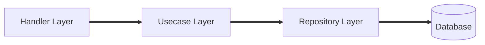
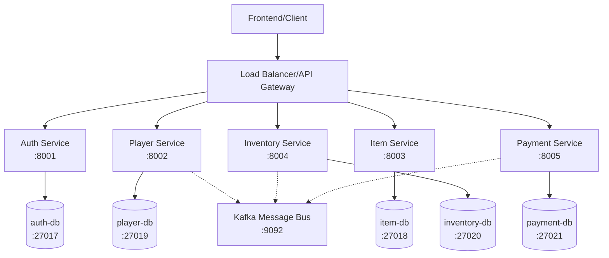
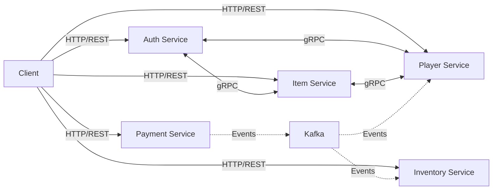
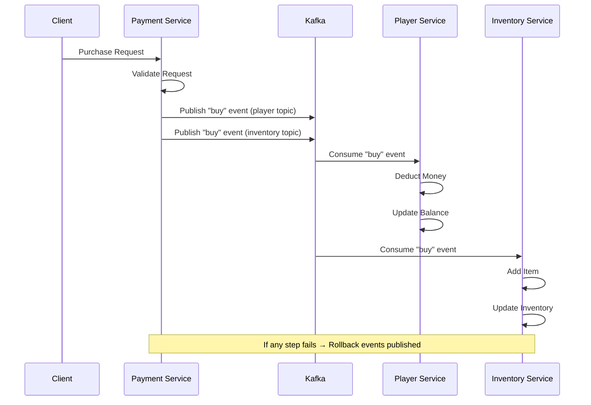
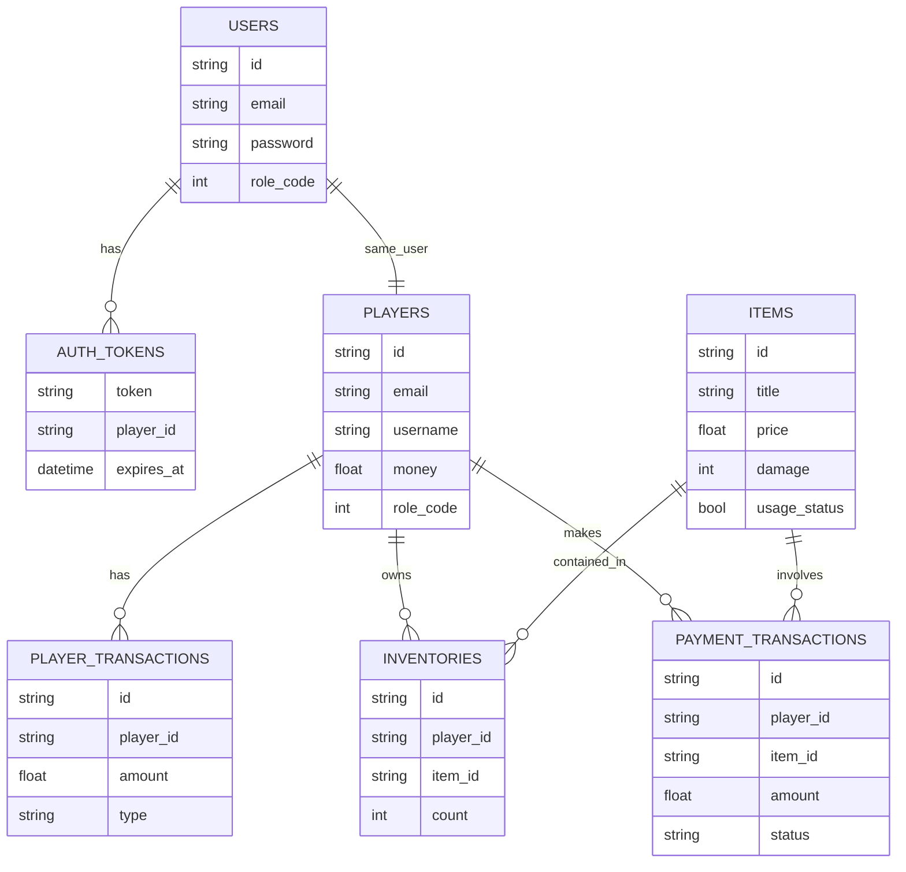
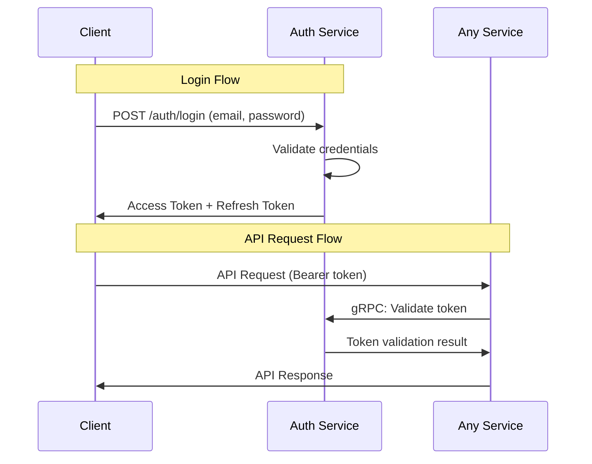

# MMORPG Shop

A microservices-based MMORPG item shop system built with Go and MongoDB.

## Architecture Patterns

### Microservices Architecture

-   **Service Decomposition**: 5 services by business domain (auth, player, item, inventory, payment)
-   **Database per Service**: Each service owns its data and schema
-   **Independent Deployment**: Services can be developed and scaled independently

### Domain-Driven Design (DDD)

-   **Bounded Context**: Each service represents a clear domain boundary
-   **Ubiquitous Language**: Service and entity names reflect gaming domain vocabulary
-   **Aggregate Root**: Each service manages its own aggregates (Player, Item, Inventory, etc.)
-   **Domain Events**: Business events published when domain state changes occur

### Clean Architecture

Each service follows layered architecture:



### Event-Driven Architecture

-   **Saga Pattern**: Distributed transactions using Kafka events
-   **Event Sourcing**: Transaction events stored as immutable records
-   **Eventual Consistency**: Cross-service data consistency through events

### Communication Patterns

-   **Synchronous**: gRPC for real-time data queries and validation
-   **Asynchronous**: Kafka for transaction events and state changes
-   **Security**: JWT tokens with RBAC authorization

### Data Management

-   **Database Isolation**: MongoDB per service for data encapsulation
-   **Offset Tracking**: Exactly-once Kafka message processing
-   **Compensating Actions**: Rollback mechanisms for failed transactions

## System Diagrams

### Architecture Overview



### Service Communication Flow



### Transaction Flow (Saga Pattern)



### Database Schema Relationships



### JWT Token Flow



## Project Structure

```
mmorpg-shop/
├── config/                 # Configuration management
├── modules/                # Business logic modules
│   ├── auth/              # Authentication service
│   ├── player/            # Player management service
│   ├── item/              # Item catalog service
│   ├── inventory/         # Player inventory service
│   ├── payment/           # Payment processing service
│   ├── middleware/        # Cross-cutting concerns
│   └── models/            # Shared data models
├── pkg/                   # Shared utilities
│   ├── database/          # Database connection and migrations
│   ├── grpcconn/          # gRPC connection utilities
│   ├── jwtauth/           # JWT authentication
│   ├── queue/             # Kafka message queue
│   ├── rbac/              # Role-based access control
│   ├── request/           # Request utilities
│   ├── response/          # Response utilities
│   └── utils/             # General utilities
├── server/                # HTTP server implementations
├── testing/               # Unit tests
└── env/                   # Environment configurations
```

## Services

### Auth Service

-   **Port**: Configurable via env
-   **Database**: auth-db (MongoDB port 27017)
-   **Endpoints**:
    -   `POST /auth_v1/auth/login` - User authentication
    -   `POST /auth_v1/auth/refresh-token` - Token refresh
    -   `POST /auth_v1/auth/logout` - User logout
-   **gRPC**: Token validation, role checking

### Player Service

-   **Port**: Configurable via env
-   **Database**: player-db (MongoDB port 27019)
-   **Endpoints**:
    -   `POST /player_v1/player/register` - Player registration
    -   `GET /player_v1/player/:player_id` - Player profile
    -   `POST /player_v1/player/add-money` - Add money to account
    -   `GET /player_v1/player/saving-account/my-account` - Account balance
-   **gRPC**: Player data queries
-   **Kafka Consumers**: Money transactions (buy/sell/rollback)

### Item Service

-   **Port**: Configurable via env
-   **Database**: item-db (MongoDB port 27018)
-   **Endpoints**:
    -   `POST /item_v1/item` - Create item (Admin only)
    -   `GET /item_v1/item/:item_id` - Get item details
    -   `GET /item_v1/items` - List items
    -   `PATCH /item_v1/item/:item_id` - Update item (Admin only)
    -   `PATCH /item_v1/item/:item_id/toggle-status` - Toggle item status (Admin only)
-   **gRPC**: Item data queries

### Inventory Service

-   **Port**: Configurable via env
-   **Database**: inventory-db (MongoDB port 27020)
-   **Endpoints**:
    -   `GET /inventory_v1/inventory/:player_id` - Player inventory
-   **Kafka Consumers**: Item transactions (add/remove/rollback)

### Payment Service

-   **Port**: Configurable via env
-   **Database**: payment-db (MongoDB port 27021)
-   **Endpoints**:
    -   `POST /payment_v1/payment/buy` - Purchase item
    -   `POST /payment_v1/payment/sell` - Sell item
-   **Kafka Producers**: Transaction events

## Technologies

-   **Language**: Go 1.24.3
-   **Web Framework**: Echo v4
-   **Database**: MongoDB v2
-   **Message Queue**: Apache Kafka (Sarama client)
-   **Authentication**: JWT tokens
-   **Communication**: REST API + gRPC
-   **Containerization**: Docker & Docker Compose

## Dependencies

### Core Dependencies

-   `github.com/labstack/echo/v4` - HTTP web framework
-   `go.mongodb.org/mongo-driver/v2` - MongoDB driver
-   `github.com/golang-jwt/jwt/v5` - JWT implementation
-   `google.golang.org/grpc` - gRPC framework
-   `github.com/IBM/sarama` - Kafka client
-   `github.com/go-playground/validator/v10` - Request validation
-   `golang.org/x/crypto` - Password hashing

### Development Dependencies

-   `github.com/stretchr/testify` - Testing framework
-   `github.com/joho/godotenv` - Environment variable loading

## Configuration

Each service requires environment configuration files in the `env/` directory:

```
env/
├── dev/
│   ├── .env.auth
│   ├── .env.player
│   ├── .env.item
│   ├── .env.inventory
│   └── .env.payment
├── prod/
└── test/
```

### Environment Variables

-   `APP_NAME` - Service name
-   `APP_URL` - HTTP server address
-   `DB_URL` - MongoDB connection string
-   `JWT_ACCESS_SECRET_KEY` - JWT access token secret
-   `JWT_REFRESH_SECRET_KEY` - JWT refresh token secret
-   `JWT_API_SECRET_KEY` - API key for gRPC
-   `GRPC_AUTH_URL` - Auth service gRPC endpoint
-   `GRPC_PLAYER_URL` - Player service gRPC endpoint
-   `GRPC_ITEM_URL` - Item service gRPC endpoint
-   `KAFKA_URL` - Kafka broker address
-   `KAFKA_API_KEY` - Kafka authentication key
-   `KAFKA_SECRET` - Kafka authentication secret

## Database Schema

### Auth Database

-   `users` - User credentials and roles
-   `auth_tokens` - Active access tokens

### Player Database

-   `players` - Player profiles and account data
-   `player_transactions` - Money transaction history
-   `player_transactions_queue` - Kafka offset tracking

### Item Database

-   `items` - Item catalog and metadata

### Inventory Database

-   `inventories` - Player item ownership
-   `inventory_transactions_queue` - Kafka offset tracking

### Payment Database

-   `payment_transactions` - Payment records and audit logs
-   `payment_transactions_queue` - Kafka offset tracking

## API Authentication

### Public Endpoints

-   `POST /auth_v1/auth/login`
-   `POST /player_v1/player/register`
-   `GET /item_v1/item/:item_id`
-   `GET /item_v1/items`
-   Health check endpoints at root path of each service

### Protected Endpoints (JWT Required)

All other endpoints require valid JWT token in Authorization header:

```
Authorization: Bearer <access_token>
```

### Admin-only Endpoints (Role-based)

-   Item management endpoints require Admin role (role_code: 0)
-   Role validation uses binary permission system

## Message Queue Events

### Kafka Topics

#### `player` Topic

-   **Key**: `buy` - Deduct money from player account
-   **Key**: `sell` - Add money to player account
-   **Key**: `rollback` - Reverse money transaction

#### `inventory` Topic

-   **Key**: `buy` - Add item to player inventory
-   **Key**: `sell` - Remove item from player inventory
-   **Key**: `rollback` - Reverse inventory transaction

### Event Processing

-   Each consumer service tracks Kafka offsets in database
-   Exactly-once processing with idempotent operations
-   Automatic retry and error handling
-   Compensating transactions for rollbacks

## gRPC Services

### Auth gRPC Service

```protobuf
service AuthGrpcService {
    rpc AccessTokenSearch(AccessTokenSearchReq) returns (AccessTokenSearchRes);
    rpc RolesCount(RolesCountReq) returns (RolesCountRes);
}
```

### Player gRPC Service

```protobuf
service PlayerGrpcService {
    rpc GetPlayerSavingAccount(GetPlayerSavingAccountReq) returns (GetPlayerSavingAccountRes);
    rpc AddPlayerMoney(AddPlayerMoneyReq) returns (AddPlayerMoneyRes);
}
```

### Item gRPC Service

```protobuf
service ItemGrpcService {
    rpc FindItemsInIds(FindItemsInIdsReq) returns (FindItemsInIdsRes);
}
```

## Security

### JWT Token Structure

```json
{
    "player_id": "string",
    "role_code": 0,
    "iss": "mmorpg-shop",
    "sub": "access-token",
    "aud": ["mmorpg-shop"],
    "exp": 1234567890,
    "nbf": 1234567890,
    "iat": 1234567890
}
```

### Role System

-   `0` (Admin): Full system access
-   `1` (Player): Standard user permissions
-   Binary operations for efficient permission checking

### Security Middleware

1. Request timeout (30 seconds)
2. CORS configuration
3. Body size limit (10MB)
4. JWT token validation
5. Role-based authorization
6. Player ID validation for resource access

## Development

### Running Services

Each service runs independently:

```bash
go run main.go env/dev/.env.auth      # Auth service
go run main.go env/dev/.env.player    # Player service
go run main.go env/dev/.env.item      # Item service
go run main.go env/dev/.env.inventory # Inventory service
go run main.go env/dev/.env.payment   # Payment service
```

### Running Dependencies

```bash
# Start MongoDB instances
docker-compose -f docker-compose.db.yml up -d

# Start Kafka
docker-compose -f docker-compose.kafka.yml up -d
```

### Running Tests

```bash
go test ./testing/...
```

### Database Migration

```bash
go run pkg/database/script/migration.go
```

## Monitoring

### Health Checks

Each service exposes health check at root endpoint:

-   `GET /` - Service health status

### Logging

-   Structured logging with request correlation
-   Error tracking and request/response logging
-   Kafka message processing logs
-   gRPC request/response logs

### Graceful Shutdown

All services handle SIGINT and SIGTERM signals for graceful shutdown with 10-second timeout.
